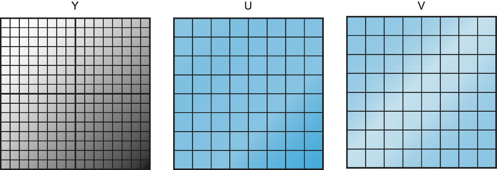

# {{Paj.Toe}}

根据许多估计,由音频ㄡ视频和静态图像组成的多媒体数据现在构成了互联网上的大部分流量. 这是一个相对较新的发展,现在很难相信,但在2005之前没有YouTube. 使多媒体在网络上广泛传播的一部分是压缩技术的进步. 因为多媒体数据主要由人类使用他们的感官-视觉和听觉-来消耗,并且由人脑处理,所以压缩它存在独特的挑战. 你想尽量保留对人类最重要的信息,同时去掉那些不能提高人类视觉或听觉感受的任何东西. 因此,计算机科学和人类感知的研究开始发挥作用. 在本节中,我们将介绍一些在多媒体数据的表示和压缩方面的主要努力. 

当然,压缩的使用不限于多媒体数据,例如,您可能已经使用过类似的实用程序. `zip`或`compress`在通过网络发送文件之前压缩文件,或在下载后解压缩数据文件. 事实证明,用于压缩数据的技术通常是典型的. *无损的*,因为大多数人不喜欢从文件中丢失数据,也显示出作为多媒体压缩解决方案的一部分. 相反,*有损压缩*通常用于多媒体数据,并不保证所接收的数据与所发送的数据完全相同. 如上所述,这是因为多媒体数据通常包含对接收它的人没有多大用处的信息. 我们的感官和大脑只能感知到如此多的细节. 他们也很擅长填充缺失的部分,甚至纠正我们看到或听到的错误. 而且,有损算法通常比无损算法获得更好的压缩比;它们可以是更好的数量级或者更多. 

为了了解压缩对网络多媒体的传播有多重要,请考虑下面的例子. 高清电视屏幕的像素数是1080$乘以$\\1920$,每个像素都有24位的颜色信息,所以每帧是

1080美元\\ 1920倍\\ 24 = 50 \\ $MB $

因此,如果你想发送每秒24帧,这将超过1μgbps. 这比大多数互联网用户能够获得的利润大得多. 相比之下,现代的压缩技术能够得到相当高质量的HDTV信号,其范围可达10Mbps,幅度减小两个数量级,而且在很多宽带用户所能及的范围内. 类似的压缩增益也适用于较低质量的视频,比如YouTube剪辑ℴℴ如果没有压缩来让所有这些娱乐视频都适合当今网络的带宽,Web视频不可能达到其目前的流行程度. 

近年来,应用于多媒体的压缩技术得到了很大的创新,尤其是有损压缩. 然而,无损技术也起着重要的作用. 实际上,大多数有损技术都包括一些无损的步骤,因此我们首先讨论无损压缩的概况. 

## 无损压缩技术

在许多方面,压缩与数据编码是分不开的. 在考虑如何将一段数据编码为一组位时,我们不妨考虑如何将数据编码为尽可能小的一组位. 例如,如果您有一个由26个符号A到Z组成的数据块,并且如果所有这些符号在您正在编码的数据块中出现的机会相等,那么以5位编码每个符号是最好的 (因为2$^5$$= 32是上面2次幂的最低值) . 26) . 然而,如果符号R出现50%的时间,那么使用比任何其他符号更少的位来编码R将是一个好主意. 一般来说,如果您知道每个符号将在数据中出现的相对概率,那么您可以以最小化编码给定数据块所需的位数的方式为每个可能的符号分配不同的位数. 这是基本的想法*霍夫曼编码*数据压缩的一个重要的早期发展. 

### 游程长度编码

游程编码 (RLE) 是一种具有简单性的压缩技术. 其思想是仅用一个符号副本,加上该符号出现次数的计数,来替换给定符号的连续出现,因此,名称*游程长度*. 例如,字符串`AAABBCDDDD`将被编码为`3A2B1C4D`.

RLE原来是有用的压缩一些类别的图像. 通过比较相邻像素值,然后仅对这些变化进行编码,就可以在这种情况下使用. 对于具有大均匀区域的图像,这种技术是非常有效的. 例如,RLE可以实现对扫描文本图像的8~1的压缩比. RLE在这些文件上工作得很好,因为它们通常包含大量可以删除的空白. 事实上,RLE是用于传输传真的关键压缩算法. 然而,对于局部变化程度很小的图像,压缩实际上增大图像字节大小并不罕见,因为当不重复该符号时,表示单个符号需要2个字节. 

### 差分脉冲编码调制

另一种简单的无损压缩算法是差分脉冲编码调制 (DPCM) . 这里的思想是首先输出一个参考符号,然后对于数据中的每个符号,输出该符号和参考符号之间的差. 例如,使用符号A作为参考符号,字符串`AAABBCDDDD`将被编码为`A0001123333`因为A与参考符号相同,所以B与参考符号的差为1,依此类推. 注意,这个简单的示例没有说明DPCM的真正好处,即当差异较小时,可以用比符号本身更少的位对其进行编码. 在这个例子中,差值范围0-3可以用每个2位来表示,而不是完整字符所需的7或8位. 一旦差异变得太大,就选择一个新的参考符号. 

对于大多数数字图像,DPCM比RLE工作得更好,因为它利用了相邻像素通常相似的事实. 由于这种相关性,相邻像素值之间的差值的动态范围可以显著小于原始图像的动态范围,因此可以使用更少的比特来表示该范围. 使用DPCM,我们测量了在数字图像上的压缩比为1.5-1. DPCM也适用于音频,因为音频波形的相邻样本很可能接近于数值. 

稍微不同的方法,叫做*增量编码*简单地将符号编码为与前一个符号不同的符号. 因此,例如,`AAABBCDDDD`将被表示为`A001011000`. 注意,增量编码对于相邻像素相似的图像编码可能很好. 在增量编码之后执行RLE也是可能的,因为如果相邻有许多类似的符号,我们可能会发现0s的长字符串. 

### 基于词典的方法

最后考虑的无损压缩方法是基于字典的方法,其中最著名的是Lempel-Ziv(LZ)压缩算法. UNIX`compress`和`gzip`命令使用LZ算法的变体. 

基于字典的压缩算法的思想是构建一个字典 (表) ,其中包含您期望在数据中找到的可变长度字符串 (把它们看作常用短语) ,然后当这些字符串出现在数据中时,用字典的相应索引替换它们例如,您可以将每个单词视为字符串,并在字典中输出该单词的索引,而不是在文本数据中处理单个字符. 为了进一步阐述这个例子,这个词*压缩*在一个特定的字典中有索引4978;它是第四千九百七十八个单词. 为了压缩正文,每次出现字符串"压缩",它将被4978替换. 由于该特定字典中只有超过25000个字,所以对索引进行编码需要15位,这意味着字符串"压缩"可以用15位来表示,而不是7位ASCII所需的77位. 这是5比1的压缩比!在另一个数据点,我们可以得到2到1的压缩比,当我们应用`compress`对本书中描述的协议的源代码进行命令. 

当然,这就引出了字典从何而来的问题. 一种选择是定义静态字典,最好是为压缩数据定制的字典. LZ压缩使用的更一般的解决方案是基于被压缩数据的内容自适应地定义字典. 然而,在这种情况下,在压缩期间构造的字典必须与数据一起发送,以便算法的解压缩部分能够完成其工作. 确切地说,如何构建自适应词典一直是广泛研究的主题;在本章的最后,我们将讨论关于这个主题的重要论文. 

## 图像表示与压缩 (GIF,JPEG) 

鉴于近年来数字图像使用的增加-这种使用是由图形显示器的发明而不是高速网络产生的-对数字图像数据的标准表示格式和压缩算法的需求变得越来越重要. 为了满足这种需要,ISO定义了一种称为*JPEG*以联合摄影专家组命名.  (JPEG中的"联合"代表联合ISO/ITU努力. ) JPEG是目前使用最广泛的静态图像格式. 在格式定义的核心是压缩算法,我们将在下面描述. JPEG中使用的许多技术也出现在MPEG中,MPEG是运动图像专家组创建的视频压缩和传输标准集. 

在深入研究JPEG的细节之前,我们观察到,从数字图像到图像的压缩表示需要相当多的步骤,这些步骤可以由接收机正确地发送ㄡ解压缩和显示. 你可能知道数字图像是由像素构成的 (因此,数码相机广告中引用的百万像素) . 每个像素表示组成图像的二维网格中的一个位置,对于彩色图像,每个像素具有一些表示颜色的数值. 有多种表示颜色的方法,称为*颜色空间*最熟悉的是RGB (红ㄡ绿ㄡ蓝) . 你可以把颜色想象成一个三维的量ℴℴ你可以用红ㄡ绿ㄡ蓝三种不同量的光来制作任何颜色. 在三维空间中,有许多不同的ㄡ有效的方法来描述给定点 (例如,考虑笛卡尔坐标和极坐标) . 同样,有多种方法来描述颜色使用三个数量,最常见的替代RGB是YUV. Y是亮度,大致是像素的整体亮度,U和V包含色度或颜色信息. 令人困惑的是,YUV颜色空间也有一些不同的变体. 更多关于这一刻. 

本讨论的意义在于,彩色图像的编码和传输 (静止的或运动的) 需要在颜色空间上的两端之间达成一致. 否则,你最终会收到不同的颜色显示的接收器比被捕获的发送者. 因此,就颜色空间定义 (或许还有一种方式来传达使用哪个特定空间) 达成一致是任何图像或视频格式的定义的一部分. 

让我们看看图形交换格式 (GIF) 的例子. GIF使用RGB颜色空间,从8位开始,总共代表24位的三维颜色中的每个. 然而,GIF首先将24位彩色图像减少到8位彩色图像,而不是发送每像素24位. 这是通过识别图片中使用的颜色 (其中通常少于2$^{24}$$$$$) ,然后选择最接近图片中使用的颜色的256种颜色来完成的. 然而,可能存在超过256种颜色,所以诀窍是通过选择256种颜色来尽量不使颜色失真太多,这样没有像素的颜色变化太大. 

256种颜色存储在一个表中,该表可以用8位编号索引,每个像素的值由适当的索引替换. 请注意,这是一个具有超过256个颜色的图片的有损压缩的例子. GIF然后对结果运行LZ变体,将常见的像素序列作为组成字典的字符串ℴℴ无损操作. 使用这种方法,GIF有时能够实现10:1级的压缩比,但只有在图像由相对少量的离散颜色组成的情况下. 图形标识,例如,通过GIF处理得很好. 自然场景的图像,通常包括更连续的光谱颜色,不能使用GIF以该比率压缩. 在某些情况下,对于人眼来说,检测GIF的有损色彩减少所引起的失真也不是太困难. 

JPEG格式更适合拍摄图像,正如您希望给出创建它的组的名称一样. JPEG不会减少像GIF这样的颜色数量. 相反,JPEG通过将RGB颜色 (通常是从数码相机获得的颜色) 转换为YUV空间开始. 其原因与眼睛感知图像的方式有关. 眼睛中存在着亮度的受体,以及颜色的独立受体. 因为我们非常善于感知亮度的变化,所以在传输亮度信息上花费更多的比特是有意义的. 由于YUV的Y分量大致是像素的亮度,因此我们可以从其他两个分量 (色度) 中分离且不那么积极地压缩该分量. 

如上所述,YUV和RGB

```pseudo
Y = 0.299R + 0.587G + 0.114B
U = (B-Y) x 0.565
V =  (R-Y) x 0.713
```

这里的常数并不重要,只要编码器和解码器同意它们是什么.  (译码器必须应用逆变换来恢复驱动显示器所需的RGB分量. ) 然而,这些常数是基于人类对颜色的感知而精心选择的. 可以看到,亮度Y是红色ㄡ绿色和蓝色分量的总和,而U和V是色差分量. U表示亮度和蓝色之间的差异,V表示亮度和红色之间的差异. 您可能注意到,将RㄡG和B设置为它们的最大值 (对于8位表示为255) 也会产生Y=255的值,而在这种情况下,U和V将为零. 也就是说,完全的白色像素在RGB空间中是 (255255255) ,在YUV空间中是 (255,0,0) . 

<figure class="line">
	<a id="yuvsub"></a>
	
	<figcaption>Subsampling the U and V components of an
    image.</figcaption>
</figure>

一旦图像被转换成YUV空间,我们现在可以考虑分别压缩三个分量中的每一个. 我们想要更积极地压缩U和V成分,而人类眼睛则不那么敏感. 压缩U和V分量的一种方法是*子样本*他们. 子采样的基本思想是取多个相邻像素,计算该组像素的平均U或V值,并发送该值,而不是发送每个像素的值. [图1](#yuvsub)说明了这一点. 亮度 (Y) 分量不被子采样,所以所有像素的Y值将被发送,如左边16$乘以$16的像素网格所示. 在U和V的情况下,我们将四个相邻像素的每个组作为一个组,计算该组的U或V值的平均值,并发送它. 因此,我们最终得到8美元$\\ 8美元的U和V值的网格来传输. 因此,在这个示例中,对于每四个像素,我们传输六个值 (四个Y以及U和V中的每一个) ,而不是原始的12个值 (对于所有三个组件每个四个) ,以便信息减少50%. 

值得注意的是,在子采样中,您可能或多或少地具有攻击性,从而相应地增加压缩并降低质量. 这里所示的子采样方法,其中色度在水平和垂直方向上被二次采样(并且通过标识4:2:0),碰巧匹配用于JPEG和MPEG的最常见的方法. 

<figure class="line">
	<a id="jpeg"></a>
	
	<figcaption>Block diagram of JPEG compression.</figcaption>
</figure>

一旦进行了二次采样,我们现在有三个像素的网格来处理,每个单独处理. 每个组件的JPEG压缩发生在三个阶段,如[图2](#jpeg). 在压缩侧,图像通过这三个阶段一次一次8美元$\\$ 8块被馈送. 第一阶段将离散余弦变换 (DCT) 应用于块. 如果你认为图像是空间域中的一个信号,那么DCT将这个信号转换成等效信号. *空间频率*领域. 这是一个无损的操作,但是是下一个有损步骤的必要前兆. 在DCT之后,第二阶段对得到的信号进行量化,这样做将丢失该信号中包含的最不重要的信息. 第三阶段对最终结果进行编码,但是在这样做时,还将无损压缩的元素添加到由前两阶段实现的有损压缩中. 减压遵循相同的三个阶段,但以相反的顺序进行. 

### 离散余弦变换相位

DCT是与快速傅立叶变换 (FFT) 密切相关的变换. 它需要一个8美元$\\ 8美元的像素值矩阵作为输入,并输出一个8美元$\\ $$ 8矩阵的频率系数. 可以将输入矩阵看作在两个空间维度 ($$x$$和$$y$$$) 中定义的64点信号;DCT将这个信号分解为64个空间频率. 为了获得对空间频率的直觉感觉,想象一下你自己在一张图片中移动,比如$x$$方向. 你会看到每个像素的值变化为$x$$的一些函数. 如果这个值随着$$x$$的增加而缓慢变化,那么它的空间频率就低;如果它快速变化,那么它的空间频率就高. 因此,低频对应于画面的总体特征,而高频对应于精细细节. DCT背后的思想是将观看图像所必需的粗略特征与细微细节分开,细微细节不那么重要,在某些情况下,眼睛可能几乎察觉不到. 

DCT,连同它的逆,恢复原始像素和在解压缩期间,由以下公式定义: 

$ $ \\开始{对齐} DCT (i,j) & = & \\Frac{{ 1 }{{qrt{2n}} C (i) c (j) \\和*{x=0 }^ ^ n-1 }和*{y=0 } ^ {n-1 }像素 (x,y) \\cs\\左方[\Frace{( +2x)1\ i }{π}\2n右]\\cs\\左侧[\Frace{( +2y)1\ j }{π}\2n右]\\\\ MthIT {Simult} (x,y) & = & \\Frac{{ 1 }{{qrt{2n}}求和*{i=0 }^ ^ n-1 }和*{j=0 } ^ {n-1 } C (i) c (j) dCT (i,j) \\cs\\左侧[\Frace{( +2x)1\ i }{π}\2n右]\\cs\\左侧[\Frace{( +2y)1\ j }{π}\2n右]\\{{}} $

其中$$C(x)=1/sqrt{2}$$当$$x=0$$时为$$,而$$.(x,y)$$是当$$x>0$$时为$$1$,而$$.(x,y)$$是在被压缩的8$$乘以$$8块中的$$(x,y)$$位置处的像素的灰度值;在这种情况下,N=8. 

在输出矩阵中的位置 (0,0) 处的第一频率系数称为*直流系数*. 直观地,我们可以看到,DC系数是64个输入像素的平均值的量度. 输出矩阵的其他63个元素称为*交流系数*. 它们将更高的空间频率信息加入到这个平均值中. 因此,当你从第一频率系数走向第64频率系数时,你正从低频信息走向高频信息,从图像的宽泛笔触走向更精细的细节. 这些较高的频率系数对图像的感知质量越来越不重要. 这是JPEG的第二阶段,它决定哪一部分系数被丢弃. 

### 量化相位

JPEG的第二阶段是压缩变得有损的地方. DCT本身不会丢失信息;它只是将图像转换为便于知道要删除什么信息的形式.  (虽然没有损失,*本身*当然,由于使用定点算术,在DCT阶段存在一些精度损失. ) 量化易于理解-这只是降低频率系数的不重要位的问题. 

要了解量化阶段是如何工作的,请设想您想要压缩一些小于100的整数,例如45ㄡ98ㄡ23ㄡ66和7. 如果你觉得知道这些数字被截断到10的最近倍数就足够了,那么你可以用整数算术把每个数字除以量子10,得到4ㄡ9ㄡ2ㄡ6和0. 这些数字可以被编码在4位,而不是编码原始数字所需的7位. 

<a id="quant"></a>

|  量子 |     |     |     |     |     |     |     |
| --: | --: | --: | --: | --: | --: | --: | --: |
|   三 |   五 |   七 |   九 |  十一 |  十三 |  十五 |  十七 |
|   五 |   七 |   九 |  十一 |  十三 |  十五 |  十七 |  十九 |
|   七 |   九 |  十一 |  十三 |  十五 |  十七 |  十九 | 二十一 |
|   九 |  十一 |  十三 |  十五 |  十七 |  十九 | 二十一 | 二十三 |
|  十一 |  十三 |  十五 |  十七 |  十九 | 二十一 | 二十三 | 二十五 |
|  十三 |  十五 |  十七 |  十九 | 二十一 | 二十三 | 二十五 | 二十七 |
|  十五 |  十七 |  十九 | 二十一 | 二十三 | 二十五 | 二十七 | 二十九 |
|  十七 |  十九 | 二十一 | 二十三 | 二十五 | 二十七 | 二十九 | 三十一 |

*表1. 示例JPEG量化表. *

JPEG没有对所有64个系数使用相同的量子,而是使用一个量化表,该表给出用于每个系数的量子,如下面给出的公式中所指定的. 你可以想到这张桌子 (`Quantum`作为一个参数,可以被设置为控制丢失多少信息,并且相应地,实现了多少压缩. 在实践中,JPEG标准指定一组已被证明在压缩数字图像方面有效的量化表;[表1](#quant). 在像这样的表中,低系数具有接近于1的量子 (意味着低频信息损失很少) ,而高系数具有更大的值 (意味着更多的高频信息损失) . 注意,作为这种量化表的结果,许多高频系数在量化之后最终被设置为0,使得它们在第三阶段中进一步压缩的成熟. 

基本量化方程是

```pseudo
QuantizedValue(i,j) = IntegerRound(DCT(i,j), Quantum(i,j))
```

哪里

```pseudo
IntegerRound(x) =
    Floor(x + 0.5) if x >= 0
    Floor(x - 0.5) if x < 0 	
```

然后将减压定义为

```pseudo
DCT(i,j) = QuantizedValue(i,j) x Quantum(i,j)
```

例如,如果特定块的DC系数(即,DCT(0,0))等于25,则使用以下方法量化该值[表1](#quant)将导致

```pseudo
Floor(25/3+0.5) = 8
```

在减压期间,这个系数将被恢复为8 $ $\\ $ $ 3=24. 

### 编码阶段

JPEG的最后阶段以紧凑的形式对量化的频率系数进行编码. 这导致额外的压缩,但这种压缩是无损的. 从位置 (0,0) 的DC系数开始,系数以锯齿形序列处理. [图3](#zigzag). 沿着这个曲折,使用游程编码的形式-RLE仅应用于0系数,这很重要,因为许多后面的系数是0. 然后使用赫夫曼码对各个系数值进行编码.  (JPEG标准允许实现者使用算术编码代替赫夫曼码. ) 

<figure class="line">
	<a id="zigzag"></a>
	
	<figcaption>Zigzag traversal of quantized frequency coefficients.</figcaption>
</figure>

此外,由于DC系数包含源图像中关于8$乘以$8块的大部分信息,并且图像通常从一个块到另一个块变化缓慢,所以每个DC系数被编码为与前一DC系数的差. 这是后面一节中描述的delta编码方法. 

JPEG包括许多变化,这些变化控制了你实现的压缩与图像的保真度. 这可以通过使用不同的量化表来实现. 这些变化,加上不同的图像具有不同的特性,使得不可能精确地说出用JPEG可以实现的压缩比. 30:1的比率是常见的,并且较高的比率当然是可能的,但是*人工产品* (由于压缩引起的明显失真) 在更高的比率下变得更严重. 

## 视频压缩 (MPEG) 

现在我们把注意力转向MPEG格式,它是由定义它的运动图像专家组命名的. 对于第一近似,运动图像 (即视频) 仅仅是连续的静止图像,也被称为静止图像. *框架*或*图片*-以某种视频速率显示. 每个帧可以使用相同的基于DCT的技术在JPEG中压缩. 然而,此时停止将是一个错误,因为它无法消除视频序列中存在的帧间冗余. 例如,如果场景中没有太多的运动,那么两个连续的视频帧将包含几乎相同的信息,因此不需要两次发送相同的信息. 即使在有运动的情况下,也可能存在大量的冗余,因为运动对象可能不会从一帧改变到下一帧;在某些情况下,仅改变其位置. MPEG考虑了帧间冗余. MPEG还定义了一种用视频对音频信号进行编码的机制,但是在本节中我们只考虑MPEG的视频方面. 

### 框架类型

MPEG将视频帧序列作为输入,并将它们压缩成三种类型的帧,称为*I帧* (内部) *P帧* (预测图片) ,以及*B帧* (双向预测图像) . 每个输入帧被压缩成这三种帧类型中的一种. I帧可以看作参考帧,它们是自包含的,这既取决于早期帧,也不取决于后续帧. 对于第一个近似,Ii帧只是视频源中相应帧的JPEG压缩版本. P和B帧不是自包含的,它们从一些参考帧中指定了相对差异. 更具体地说,P帧指定与前一I帧的区别,而B帧给出前一和后续I或P帧之间的内插. 

<figure class="line">
	<a id="mpeg"></a>
	
	<figcaption>Sequence of I, P, and B frames generated by MPEG.</figcaption>
</figure>

[图4](#mpeg)图示了七个视频帧序列,在被MPEG压缩后,产生一系列的IㄡP和B帧. 两个I帧单独存在,每个独立于其他帧可以在接收器中解压缩. P帧取决于前一个I帧,只有当前一个I帧也到达时才能在接收机处解压缩. B帧的每一个都依赖于前一个或P帧和随后的I或P帧. 这两个参考帧必须在MPEG解压缩B帧以再现原始视频帧之前到达接收机. 

注意,因为每个B帧取决于序列中的后续帧,所以压缩帧不是按顺序发送的. 相反,序列Ⅰb b b p b b i显示在[图4](#mpeg)此外,MPEG没有定义I帧与P帧和B帧的比率;该比率可以根据所需的压缩和图像质量而变化. 例如,只允许传输I帧. 这将类似于使用JPEG压缩视频. 

与前面讨论的JPEG相比,下面的重点是*译码*一个MPEG流. 它稍微容易描述,并且它是在今天的网络系统中更经常实现的操作,因为MPEG编码是如此昂贵以至于它经常离线 (即,不实时) 完成. 例如,在视频点播系统中,视频将被编码并提前存储在盘上. 当观众想要观看视频时,MPEG流将被传输到观众的机器,该机器将实时解码并显示该流. 

让我们更仔细地看看这三种框架类型. 如上所述,Ii帧近似等于源帧的JPEG压缩版本. 主要区别在于MPEG以16美元$\\ 16美元的宏块为单位工作. 对于用YUV表示的彩色视频,每个宏块中的U和V分量被子采样到8$乘以$$8块,如我们在上面在JPEG上下文中所讨论的. 每个宏块中的每个$$ $ \\ $ $ 2子块由一个U值给出,并且一个V值是四个像素值的平均值. 子块仍然有四个Y值. 给出了帧与相应宏块之间的关系. [图5](#macroblock).

<figure class="line">
	<a id="macroblock"></a>
	
	<figcaption>Each frame as a collection of macroblocks.</figcaption>
</figure>

P和B帧也以宏块为单位进行处理. 直观地,我们可以看到它们为每个宏块携带的信息捕获了视频中的运动;也就是说,它显示了宏块相对于参考帧在什么方向上移动以及移动了多远. 下面描述如何在解压缩期间使用B帧来重构帧;P帧以类似的方式处理,只是它们仅依赖于一个参考帧而不是两个. 

在讨论如何对B帧进行解压缩的细节之前,我们首先注意到,B帧中的每个宏块不一定像上面建议的那样相对于较早的帧和较晚的帧进行定义,而是可以简单地相对于一个或另一个进行指定. 事实上,B帧中的给定宏块可以使用与I帧中使用的相同的内插. 这种灵活性之所以存在,是因为如果电影变化太快,那么有时给出画面内编码而不是向前或向后预测编码是有意义的. 因此,B帧中的每个宏块包括指示该宏块使用哪个编码的类型字段. 然而,在下面的讨论中,我们只考虑宏块使用双向预测编码的一般情况. 

在这种情况下,B帧中的每个宏块用4元组表示: (1)帧中宏块的坐标,(2)相对于前一参考帧的运动矢量,(3)相对于后续参考帧的运动矢量,以及(4)每个像素的δ($\\delta$). 在宏块中 (即,每个像素相对于两个参考像素改变了多少) . 对于宏块中的每个像素,第一任务是在过去和未来的参考帧中找到对应的参考像素. 这是使用与宏块相关联的两个运动向量来完成的. 然后,将像素的增量添加到这两个参考像素的平均值. 更准确地说,如果我们让$F_p$$和$F_f$$分别表示过去和未来的参考帧,并且过去/未来的运动矢量由$(x_p,y_p)$$和$(x_f,y_f)$$给出,那么坐标为$(x,y)$$的当前帧中的像素(表示$$F_c$)被计算为

$FYC (x,y) = (fxp (x+xpp,y+yyp) +fyf (x+xyf,y+yyf) ) / 2+δ (x,y) $ $

$ $\\delta $$是在B帧中指定的像素的增量. 这些Deltas以与I帧中的像素相同的方式编码;也就是说,它们通过DCT运行,然后量化. 由于增量通常很小,所以大部分DCT系数在量化后是0,因此可以有效地压缩它们. 

从前面的讨论中可以清楚地知道如何执行编码,有一个例外. 当在压缩过程中生成B或P帧时,MPEG必须决定将宏块放置在何处. 回想一下,例如,P帧中的每个宏块是相对于I帧中的宏块定义的,但是P帧中的宏块不必与I帧中的相应宏块在帧的相同部分ℴℴ位置的差异由运动矢量给出. 您希望选择一个运动矢量,使得P帧中的宏块尽可能类似于I帧中的相应宏块,以便该宏块的增量可以尽可能小. 这意味着您需要确定图片中的对象从一个帧移动到下一个帧. 这就是问题*运动估计*以及用于解决此问题的若干技术 (启发式) 是已知的.  (我们在本章末尾讨论了考虑这个问题的论文. ) 这个问题的难度是MPEG编码比在等效硬件上解码花费更长时间的原因之一. MPEG-DO

### 效能与绩效

MPEG通常实现压缩比为90-1,虽然比率高达150∶1是前所未闻的. 就各个帧类型而言,对于I帧,我们可以期望大约30:1的压缩比(这与当24位颜色首先减少到8位颜色时使用JPEG实现的比率是一致的),而P和B帧压缩比通常为sma的3-5倍. LILE比I帧的速率要高. 在不首先将24位的颜色减少到8位的情况下,用MPEG实现的压缩通常在30:50和50:1之间. 

MPEG涉及昂贵的计算. 在压缩端,它通常是离线的,这不是为视频点播服务准备电影的问题. 视频可以使用硬件实时压缩,但软件实现很快就缩小了差距. 在解压缩方面,低成本的MPEG视频板是可用的,但它们只做YUV颜色查找,幸运的是这是最昂贵的步骤. 大多数实际的MPEG解码都是在软件中完成的. 近年来,当纯粹用软件解码MPEG流时,处理器已经变得足够快以跟上每秒30帧的视频速率,现代处理器甚至可以解码高清晰度视频(HDTV)的MPEG流. 

### 其他视频编码标准

我们得出结论,MPEG不是任何手段是唯一的标准可用于编码视频. 例如,ITU-T也定义了*H系列*用于编码实时多媒体数据. 通常,H系列包括视频ㄡ音频ㄡ控制和复用 (例如,将音频ㄡ视频和数据混合到单个比特流上) 的标准. 在该系列中,H.261和H.263是第一代和第二代视频编码标准. 与早期版本的MPEG不同,H.261和H.263是以1.5Mbps的位速率为目标的,而H.261和H.263是以较低速度为目标的. 为综合服务数字网络 (ISDN) 标准设计,它们支持通过链接的视频,带宽以64kbps递增. 原则上,H.261和H.263看起来都很像MPEG: 它们使用DCTㄡ量化和帧间压缩. 详细介绍了H.261/H.263和MPEG的区别. 事实上,更新的H.264标准也是MPEG-4标准的一部分. 随着视频在越来越多的设备上得到支持,从通过低带宽蜂窝无线链路连接的小屏幕设备到连接到高带宽光纤链路的大型电视,这个领域可能需要更多的创新和新标准. 

## 通过网络传输MPEG

正如我们注意到的,MPEG和JPEG不仅是压缩标准,而且分别是视频和图像格式的定义. 关注MPEG,首先要记住的是,它定义了视频的格式. *流动*它没有指定如何将该流分解成网络分组. 因此,MPEG可以用于存储在磁盘上的视频,以及通过面向流的网络连接传输的视频,如TCP提供的. 更多的是如何在一瞬间打包MPEG流. 

MPEG格式是本书中讨论的任何协议中最复杂的一种. 这种复杂性来自于希望给编码算法在如何编码给定视频流方面每个可能的自由度. 它也来自于标准随时间的演变 (即,MPEG-1,MPEG-2,MPEG-4) . 下面我们所说的叫做*主剖面*一个MPEG-2视频流. 您可以认为MPEG概要文件类似于"版本",只是概要文件没有在MPEG头部中明确指定;接收方必须从它所看到的头部字段的组合中推断概要文件. 

<figure class="line">
	<a id="nested"></a>
	
	<figcaption>Format of an MPEG-compressed video stream.</figcaption>
</figure>

主配置文件MPEG-2流具有嵌套结构,如图所示[图6](#nested).  (记住这个数字隐藏了一个*许多*在最外面的一层,视频包含一组图片 (GOP) . `SeqHdr`. 序列由A终止. `SeqEndCode` (`0xb7`) 这个`SeqHdr`在每个GOP之前指定GOP中每幅图片 (帧) 的大小 (用像素和宏块测量) ㄡ插值周期 (用$mu$$s测量) 和这个GOP中的宏块的两个量化矩阵: 一个用于内部编码的宏块 (I块) S) 和一个用于互编码宏块 (B和P块) . 由于这些信息是针对每个GOP给出的,而不是针对整个视频流给出一次,正如您所期望的,因此有可能在整个视频中改变GOP边界处的量化表和帧速率. 这使得有可能随着时间的推移来适应视频流,正如我们下面讨论的. 

每个GOP由A给出`GOPHdr`接着是组成GOP的一组图片. 这个`GOPHdr`指定GOP中的图片数量以及GOP的同步信息 (即,相对于视频的开始,GOP应该何时播放) . 每个图片,依次由A给出. `PictureHdr`和一套*片*这构成了这幅图.  (切片是图片的一个区域,例如一条水平线) . `PictureHdr`标识图片的类型 (i,b,p) ,并定义图片特定的量化表. 这个`SliceHdr`给出切片的垂直位置,再加上另一个改变量化表的机会-这次用一个恒定的缩放因子而不是给出一个完整的新表. 下一步,`SliceHdr`接着是宏块序列. 最后,每个宏块包括指定图片中的块地址的标题以及宏块中六个块的数据: 一个用于U组件,一个用于V组件,四个用于Y组件.  (回忆一下,Y组件是16美元$\\ $ 16美元,而U和V组件是8美元$\\ $ 8美元) . 

应该清楚的是,MPEG格式的威力之一是它为编码器提供了随时间改变编码的机会. 它可以改变帧速率ㄡ分辨率ㄡ定义GOP的帧类型的混合ㄡ量化表以及用于单个宏块的编码. 因此,通过将图像质量与网络带宽进行交易,可以调整通过网络传输视频的速率. 网络协议可能如何利用这种适应性是当前研究的主题 (见侧栏) . 

在网络上发送MPEG流的另一个有趣的方面是流如何被分解成数据包. 如果通过TCP连接发送,包化不是问题;TCP决定何时有足够的字节来发送下一个IP数据报. 然而,当交互式地使用视频时,通过TCP传输视频是很少见的,因为TCP有几个特性不适合高度延迟敏感的应用 (例如分组丢失后的突然速率变化和丢失分组的重传) . 例如,如果我们使用UDP传输视频,那么在精心选择的点 (比如宏块边界) 中断流是有意义的. 这是因为我们希望将丢失分组的影响限制在单个宏块上,而不是用一个丢失损坏多个宏块. 这是应用层框架的一个例子,在前面的章节中讨论过. 

打包流只是在网络上发送MPEG压缩视频的第一个问题. 接下来的问题是处理丢包. 一方面,如果B帧被网络丢弃,则可以简单地重放前一帧而不严重损害视频;30帧中1帧没什么大不了的. 另一方面,丢失的I帧有严重的后果,没有后续B和P帧可以被处理. 因此,丢失I帧将导致视频的多个帧丢失. 虽然您可以重新传输丢失的I帧,但由此产生的延迟在实时视频会议中很可能是不可接受的. 这个问题的一个解决方案是使用上一章中描述的区分服务技术来标记包含I帧的分组,其丢包概率比其他分组低. 

一个最终的观察是,你选择如何编码视频取决于不仅仅是可用的网络带宽. 它还取决于应用程序的延迟约束. 再次,像视频会议这样的交互式应用需要很小的延迟. 关键因素是在GOP中的IㄡP和B帧的组合. 考虑下面的GOP: 

i b bb b p b b b i 

这个GOP引起视频会议应用的问题是,发送者必须延迟四个B帧的传输,直到后面的P或I可用为止. 这是因为每个B帧依赖于后续的P或I帧. 如果视频以每秒15帧(即,每67ms一帧)播放,这意味着第一B帧被延迟4$乘以$67ms,这超过四分之一秒. 这种延迟是除了由网络施加的任何传播延迟之外的. 四分之一秒远大于人类能够感知到的100毫秒阈值. 正是由于这个原因,许多视频会议应用程序使用JPEG编码视频,这通常被称为运动JPEG. (Motion-JPEG还解决了丢弃参考帧的问题,因为所有帧都能够独立存在. )但是,请注意,仅依赖于先前帧而不是后期帧的帧间编码不是问题. 因此,一个GOP

 i p p p i 

对于交互式视频会议来说是很好的. 

## 音频压缩 (MP3) 

MPEG不仅定义了视频是如何压缩的,而且还定义了压缩音频的标准. 该标准可以用于压缩电影的音频部分(在这种情况下,MPEG标准定义压缩音频如何在单个MPEG流中与压缩视频交织),或者可以用于压缩独立音频(例如,音频CD). 

为了理解音频压缩,我们需要从数据开始. CD质量音频,这是*事实上的*以44.1KHz的速率对高质量音频的数字表示进行采样(即,大约每隔23$\\mu$s收集一次采样). 每个采样是16位,这意味着立体声 (2声道) 音频流导致比特率

2美元\\ 44.1倍\\ 1000倍\\ 16 = 1.41 \\ Mbps $ $

相比之下,以8KHz的速率对电话质量语音进行采样,其中8位采样,导致64kbps的比特率,这与ISDN链路的速度并不一致. 

显然,要通过ISDN数据/语音线对的128-kbps容量传输CD质量的音频,需要一些压缩. 更糟糕的是,同步和纠错开销要求使用49位对每个16位采样进行编码,从而导致实际比特率

$ 49/16倍\\ 1.41 \\ Mbps=4.32 \\ Mbps $ $

MPEG通过定义三个级别的压缩来解决这一需求,如枚举[表2](#mp3). 其中,第三层,更广泛地被称为MP3,是最常用的. 

<a id="mp3"></a>

|  编码 |    比特率   | 压缩因子 |
| :-: | :------: | :--: |
| 第一层 | 384 kbps |  十四  |
| 第二层 | 192 kbps |  十八  |
| 第三层 | 128 kbps |  十二  |

*表2. MP3压缩率. *

为了实现这些压缩比,MP3使用与MPEG所使用的压缩视频相似的技术. 首先,它将音频流分割成若干个频率子带,这与MPEG分别处理视频流的YㄡU和V分量的方式大致相似. 其次,每个子带被分解成一系列块,这些块类似于MPEG的宏块,只是它们的长度可以在64到1024个样本之间变化.  (编码算法可以根据某些超出我们讨论范围的失真影响来改变块大小. ) 最后,使用改进的DCT算法对每个块进行变换,进行量化和霍夫曼编码,就像对MPEG视频一样. 

MP3的诀窍在于它选择使用多少个子频带,以及它为每个子频带分配多少比特,同时牢记它正试图为目标比特率产生尽可能高质量的音频. 这种分配的确切方式是由超出本书范围的心理声学模型控制的,但是为了说明这种想法,认为在压缩男性声音时将更多的比特分配给低频子带是有意义的,而在压缩时将更多的比特分配给高频子带是有意义的. 唱一个女声. 在操作上,MP3动态地改变用于每个子带的量化表,以达到期望的效果. 

一旦被压缩,子带被打包成固定大小的帧,并且附加一个报头. 该报头包括同步信息,以及解码器确定每个子带使用多少比特编码所需的比特分配信息. 如上所述,可以将这些音频帧与视频帧交织以形成完整的MPEG流. 一个有趣的附注是,虽然如果发生拥塞,在网络中丢弃B帧可能有效,但经验告诉我们,丢弃音频帧不是一个好主意,因为用户比坏音频更能容忍坏视频. 
