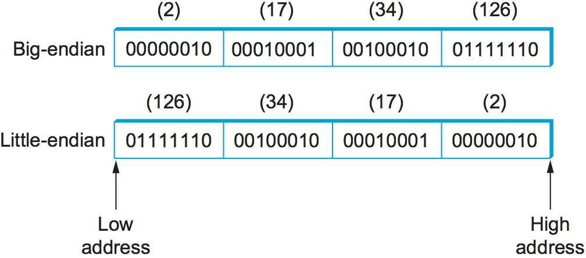
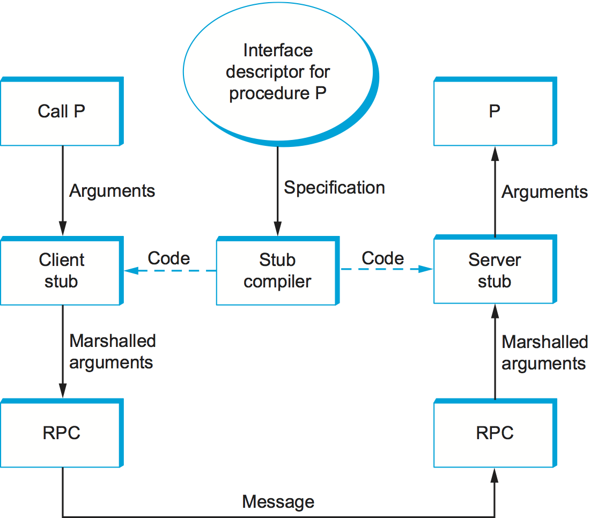
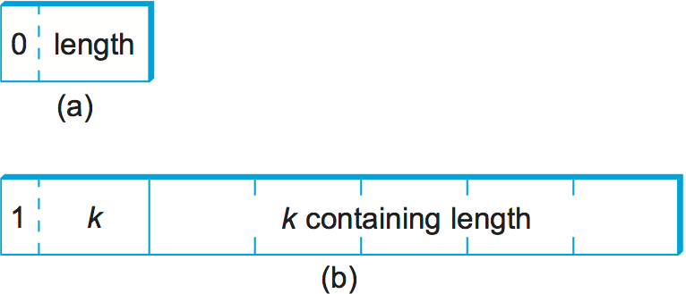

# {{Paj.Toe}}

网络数据的最常见转换之一是从应用程序使用的表示形式转换为适合于通过网络传输的形式,以及*反之亦然*. 这种转换通常称为*表示格式*. 如图所示[图1](#marshal1)发送程序将其想要从内部使用的表示形式发送的数据转换为可以通过网络发送的消息;即,数据是*编码的*在一条消息中. 在接收端,应用程序将到达的消息转换为表示形式,然后可以对其进行处理;也就是说,消息是*译码*. 编码有时被称为编码. *论证编组*解码有时被称为解码. *解组*. 这个术语来自远程过程调用 (RPC) 世界,其中客户机认为它正在用一组参数调用过程,但是这些参数随后"以适当和有效的方式组合并排序"以形成网络消息. 

<figure class="line">
	<a id="marshal1"></a>
	
	<figcaption>Presentation formatting involves encoding and decoding
	application data.</figcaption>
</figure>

你可能会问,什么使这个问题具有挑战性,足以保证编组的名称. 一个原因是计算机以不同的方式表示数据. 例如,一些计算机以IEEE标准754格式表示浮点数,而其他计算机仍然使用它们自己的非标准格式. 即使对于像整数一样简单的事物,不同的体系结构也使用不同的大小 (例如,16位ㄡ32位ㄡ64位) . 更糟糕的是,在一些机器上,整数被表示为*大字节*表单 (单词的最高有效位在具有最高地址的字节中) ,而在其他机器上,整数表示为*小字节*表单 (最高有效位位于最低地址字节) . MIPS和PowerPC处理器是大端机的例子,而Intel x86系列是小端体系结构的例子. 整数34677374的大端序和小端元表示. [图2](#endian).

<figure class="line">
	<a id="endian"></a>
	
	<figcaption>Big-endian and little-endian byte order for the integer
    34,677,374</figcaption>
</figure>

编组困难的另一个原因是应用程序用不同的语言编写,甚至当使用单个语言时,也可能有不止一个编译器. 例如,编译器在如何在内存中布局结构 (记录) 方面有相当大的自由度,例如它们在构成结构的字段之间放置了多少填充. 因此,您不能简单地将结构从一台机器传输到另一台机器,即使两台机器具有相同的体系结构,并且程序是用相同的语言编写的,因为目标机器上的编译器可能以不同的方式对齐结构中的字段. 

## 分类学

尽管任何参与过论证编组的人都会告诉你,没有火箭科学介入ℴℴ这只是一个小问题ℴℴ你必须解决许多令人惊讶的设计选择. 我们首先给出一个简单的分类论证系统. 以下绝不是唯一可行的分类法,但它足以覆盖大多数有趣的替代品. 

### 数据类型

第一个问题是系统将支持的数据类型. 一般来说,我们可以将一个参数编组机制所支持的类型分为三个层次. 每个层次使编组系统面临的任务复杂化. 

在最低水平上,编组系统在一些集合上运行. *基类型*. 通常,基类型包括整数ㄡ浮点数和字符. 该系统还可以支持序数类型和布尔值. 如上所述,基类型集的含义是编码过程必须能够将每个基类型从一个表示转换为另一个表示,例如,将整数从大端子转换为小端子. 

在下一个层次是*扁平型*-结构和数组. 虽然扁平型最初可能不会使论证编组复杂化,但事实是它们是这样做的. 问题是,用于编译应用程序的编译器有时会在构成结构的字段之间插入填充,以便将这些字段对齐到单词边界上. 编组系统典型地*包装*结构,使它们不填充. 

在最高级别上,编组系统可能需要处理. *复杂类型*-使用指针构建的那些类型. 也就是说,一个程序要发送到另一个的数据结构可能不包含在单个结构中,而是可能涉及从一个结构到另一个结构的指针. 树是涉及指针的复杂类型的一个很好的例子. 显然,数据编码器必须准备通过网络传输的数据结构,因为指针是由内存地址实现的,并且仅仅因为一个结构存在于一台机器上的某个内存地址并不意味着它将存在于另一台机器上的同一地址. 换言之,编组系统必须*串行化* (扁平化) 复杂的数据结构. 

总之,根据类型系统的复杂程度,参数编组的任务通常包括转换基本类型ㄡ打包结构和线性化复杂数据结构,所有这些都形成可以通过网络传输的连续消息. [图3](#marshal2)说明了这项任务. 

<figure class="line">
	<a id="marshal2"></a>
	
	<figcaption>Argument marshalling: converting, packing, and
    linearizing</figcaption>
</figure>

### 转换策略

一旦建立了类型系统,下一个问题是参数封送器将使用的转换策略. 一般有两种选择: *典范中间形*和*接收者做对*. 我们依次考虑每一个问题. 

规范中间形式的思想是确定每种类型的外部表示;发送主机在发送数据之前从其内部表示转换为该外部表示,并且接收器从该外部表示转换为本地表示. 当接收数据时. 为了说明这个想法,考虑整数数据;其他类型以类似的方式处理. 您可以声明大Endiad格式将用作整数的外部表示形式. 发送主机必须将其发送的每个整数转换为大端子形式,而接收主机必须将大端子整数转换为其使用的任何表示.  (这是在Internet中对协议报头所做的. ) 当然,给定主机可能已经使用大尾数形式,在这种情况下,不需要转换. 

另一种选择,接收机使权利,让发送者以自己的内部格式发送数据;发送者不转换基本类型,但通常必须打包和平坦更复杂的数据结构. 然后,接收器负责将数据从发送者的格式转换成其自己的本地格式. 这个策略的问题是每个主机必须准备好从所有其他机器体系结构转换数据. 在网络中,这被称为*N-氮溶液*每个n个机器体系结构必须能够处理所有的n个体系结构. 相比之下,在使用规范中间形式的系统中,每个主机只需要知道如何在自己的表示与单个其他表示 (外部表示) 之间进行转换. 

使用共同的外部格式显然是正确的事情,对吧?这肯定是过去25年来网络社区的传统智慧. 然而,答案并不是一成不变的. 结果是,对于不同的基类,没有那么多不同的表示,或者换句话说,N没有那么大. 此外,最常见的情况是两台相同类型的机器相互通信. 在这种情况下,将数据从该体系结构的表示形式转换为某些外部的表示形式似乎很愚蠢,只需要将数据转换回接收器上的相同体系结构的表示形式即可. 

第三种选择,虽然我们知道没有现有系统利用它,但是如果发送方知道目的地具有相同的体系结构,则使用接收方使权;如果两台机器使用不同的体系结构,则发送方将使用一些规范的中间形式. 发送者如何学习接收者的体系结构?它可以从名称服务器或首先使用一个简单的测试用例来查看是否出现适当的结果,从而了解此信息. 

### 标签

参数编组中的第三个问题是接收方如何知道接收到的消息中包含了什么样的数据. 有两种常见的方法: *标记的*和*未标记的*数据. 标记的方法更直观,所以我们首先描述它. 

标记是消息中包括的除了基本类型的具体表示之外的任何附加信息,它帮助接收方解码消息. 可能包含在消息中的几个可能的标签. 例如,每个数据项可以用*类型*标签. 类型标记指示如下的值是整数ㄡ浮点数或任何值. 另一个例子是*长度*标签. 这样的标签用于指示数组中的元素数量或整数的大小. 第三个例子是*建筑学*标记,该标记可以与接收者做出正确策略结合使用,以指定生成消息中包含的数据的架构. [图4](#tags)描述一个简单的32位整数如何在标记消息中编码. 

<figure class="line">
	<a id="tags"></a>
	
	<figcaption>A 32-bit integer encoded in a tagged
    message.</figcaption>
</figure>

当然,另一种选择是不使用标签. 在这种情况下,接收机如何知道如何解码数据?它知道,因为它被编程知道. 换句话说,如果调用一个以两个整数和一个浮点数作为参数的远程过程,则远程过程没有理由检查标记以了解它刚刚接收的内容. 它简单地假设消息包含两个整数和一个浮点,并相应地对其进行解码. 请注意,虽然这对大多数情况都适用,但它破坏的一个地方是发送可变长度数组. 在这种情况下,长度标签通常用来指示数组的长度. 

值得注意的是,未标记的方法意味着呈现格式是真正的端到端. 某些中间代理不可能对消息进行解释,除非数据被标记. 你可能会问,中间代理为什么需要解释一条消息?奇怪的事情发生了,主要是由于*自组织网络*解决系统无法处理的意外问题的解决方案. 可怜的网络设计超出了这本书的范围. 

### 短截线

存根是实现参数编组的代码块. 存根通常用于支持RPC. 在客户端,存根将过程参数编组为可以通过RPC协议传输的消息. 在服务器端,存根将消息转换回一组变量,这些变量可以用作调用远程过程的参数. 存根可以被解释或编译. 

在基于编译的方法中,每个过程都有定制的客户端和服务器存根. 虽然可以用手写存根,但是它们通常是由存根编译器根据过程接口的描述生成的. 这种情况在[图5](#stubs). 由于存根被编译,它通常是非常有效的. 在基于解释的方法中,系统提供通用的客户端和服务器存根,它们通过过程接口的描述来设置参数. 因为很容易改变这种描述,解释的存根具有灵活的优点. 编译存根在实践中更为常见. 

<figure class="line">
	<a id="stubs"></a>
	
	<figcaption>Stub compiler takes interface description as input and
	outputs client and server stubs.</figcaption>
</figure>

## 实例 (XDR,ASN,1,NDR) 

我们现在简要描述三种流行的网络数据表示在这一分类. 我们使用整型基类型来说明每个系统是如何工作的. 

### XDR

外部数据表示 (XDR) 是与SUNRPC一起使用的网络格式. 在刚刚介绍的分类中,XDR

-   除了函数指针外,支持整个C型系统

-   定义规范的中间形式

-   不使用标签 (除了指示数组长度) 

-   使用编译存根

XDR整数是编码C整数的32位数据项. 它用两个补码表示,C整数的最高有效字节位于XDR整数的第一个字节中,C整数的最低有效字节位于XDR整数的第四个字节中. 也就是说,XDR使用整数的大Endiad格式. XDR支持签名和无符号整数,就像C一样. 

XDR通过首先指定一个无符号整数 (4个字节) 来表示可变长度数组,该整数给出数组中的元素数量,然后指定适当类型的许多元素. XDR按照结构中声明的顺序对结构的组成部分进行编码. 对于两个数组和结构,每个元素/组件的大小以4个字节的倍数表示. 较小的数据类型用0填充到4个字节. 这种"pad to 4字节"规则的例外是针对每个字节编码一个的字符. 

<figure class="line">
	<a id="xdr"></a>
	
	<figcaption>Example encoding of a structure in XDR.</figcaption>
</figure>

下面的代码片段给出了一个示例C结构`item`以及对该结构进行编码/解码的XDR例程 (`xdr_item`) [图6](#xdr)示意性地描述了XDR在该结构的线表示时的字段. `name`是七个字符长和数组`list`它有三个值. 

在这个例子中,`xdr_array`,`xdr_int`和`xdr_string`由XDR提供的三个原始函数分别对数组ㄡ整数和字符串进行编码和解码. 论证`xdrs`是一个上下文变量,XDR使用该上下文变量来跟踪它在正在处理的消息中的位置;它包含一个标志,该标志指示该例程是否正被用于对消息进行编码或解码. 换句话说,例程像`xdr_item`在客户端和服务器上都使用. 请注意,应用程序程序员可以编写例程. `xdr_item`用手工或使用存根编译器称为`rpcgen` (未示出) 生成此编码/解码例程. 在后一种情况下,`rpcgen`获取定义数据结构的远程过程. `item`作为输入和输出相应的存根. 

```c
#define MAXNAME 256;
#define MAXLIST 100;

struct item {
   int     count;
   char    name[MAXNAME];
   int     list[MAXLIST];
};

bool_t
xdr_item(XDR *xdrs, struct item *ptr)
{
    return(xdr_int(xdrs, &ptr->count) &&
       xdr_string(xdrs, &ptr->name, MAXNAME) &&
       xdr_array(xdrs, &ptr->list, &ptr->count, MAXLIST,
                 sizeof(int), xdr_int));
}
```

当然,XDR的执行方式取决于数据的复杂性. 在整数数组的简单情况下,每个整数必须从一个字节顺序转换到另一个字节顺序,每个字节平均需要三个指令,这意味着转换整个数组可能受到计算机内存带宽的限制. 每字节需要明显更多指令的更复杂的转换将受CPU限制,因此以小于存储器带宽的数据速率执行. 

### ASN 1

抽象语法符号1 (ASN.1) 是一个ISO标准,它定义了通过网络发送的数据的表示. ASN. 1的表示特定部分称为*基本编码规则* (BER) . ASN. 1支持C型系统,没有函数指针,定义了规范的中间形式,并使用类型标签. 它的存根可以被解释或编译. ASN. 1 BER的名声之一是它被互联网标准的简单网络管理协议 (SNMP) 使用. 

ASN. 1表示每个数据项具有三重形式. 

```pseudo
(tag, length, value)
```

这个`tag`通常是一个8位字段,尽管ASN.1允许多字节标记的定义. 这个`length`字段指定多少字节组成`value`我们讨论`length`下面更多. 复合数据类型,如结构,可以由嵌套基元类型构造,如[图7](#ber1).

<figure class="line">
	<a id="ber1"></a>
	
	<figcaption>Compound types created by means of nesting in ASN.1
	BER.</figcaption>
</figure>

<figure class="line">
	<a id="ber2"></a>
	
	<figcaption>ASN.1 BER representation for a 4-byte integer.</figcaption>
</figure>

如果`value`是127个或更少的字节长,那么`length`在单个字节中指定. 因此,例如,32位整数被编码为1字节. `type`1字节`length`以及编码整数的4个字节,如图所示[图8](#ber2). 这个`value`本身,在整数的情况下,用两个补充符号和大EnDead形式表示,就像在XDR中一样. 记住,即使`value`在XDR和ASN 1中,整数表示完全相同的方式,XDR表示既不具有`type`也不`length`与该整数相关联的标记. 这两个标签都占用消息中的空间,更重要的是,在编组和编组过程中需要处理. 这就是为什么ASN 1没有XDR那么有效的原因之一. 另一个事实是每个数据值前面都有一个`length`字段表示数据值不太可能落在自然字节边界上 (例如,从字边界开始的整数) . 这使得编码/解码过程变得复杂. 

如果`value`128字节或更长字节,然后使用多个字节来指定其`length`. 在这一点上,你可能会问为什么一个字节可以指定一个长度为127字节而不是256字节的长度. 原因是1位的`length`字段用来表示多长时间`length`字段是. 第八位中的0表示1字节. `length`字段. 指定更长的时间`length`,第八位被设置为1,而其他7位表示有多少字节构成了`length`.[图9](#ber3)说明一个简单的1字节`length`多字节`length`.

<figure class="line">
	<a id="ber3"></a>
	
	<figcaption>ASN.1 BER representation for length: (a) 1 byte;
	(b) multibyte.</figcaption>
</figure>

### NDR

网络数据表示(NDR)是分布式计算环境(DCE)中使用的数据编码标准,我们在前一章中介绍了这种标准. 与XDR和ASN 1不同,NDR使用接收器做出正确的选择. 它通过在每个消息的前面插入架构标签来实现这一点;单个数据项未标记. NDR使用编译器生成存根. 该编译器对用接口定义语言(IDL)编写的程序进行描述,并生成必要的存根. IDL看起来很像C,因此基本上支持C型系统. 

<figure class="line">
	<a id="ndr"></a>
	
	<figcaption>NDR's architecture tag.</figcaption>
</figure>

[图10](#ndr)说明包含在每个NDR编码消息的前部的4字节架构定义标签. 第一个字节包含两个4位字段. 第一个字段,`IntegrRep`为消息中包含的所有整数定义格式. 这个字段中的0表示大的EnDead整数,1表示小的EnDIN整数. 这个`CharRep`字段指示使用什么字符格式: 0表示ASCII (美国信息交换标准代码) ,1表示EBCDIC (ASCII的较老的ㄡIBM定义的替代) . 下一步,`FloatRep`字节定义了正在使用的浮点表示: 0表示IEEE 754, 1表示VAX,2表示Cayy,3表示IBM. 最后2字节保留以备将来使用. 注意,在诸如整数数组这样的简单情况下,NDR所做的工作量与XDR相同,因此它能够实现相同的性能. 

## 标记语言 (XML) 

虽然我们已经从RPC的角度讨论了表示格式问题,也就是说,如何对原始数据类型和复合数据结构进行编码,以便将它们从客户端程序发送到服务器程序,但是在其他设置中也会出现相同的基本问题. 例如,Web服务器如何描述网页,以便任何数量的不同浏览器知道在屏幕上显示什么?在这种情况下,答案是超文本标记语言 (HTML) ,它指示某些字符串应该以粗体或斜体显示,应该使用什么字体类型和大小,以及应该将图像定位在哪里. 

Web的巨大普及以及各种应用程序和数据在其上的可用性也造成了一种情况,其中不同的Web应用程序需要彼此通信并理解彼此的数据. 例如,电子商务网站可能需要与航运公司的网站交谈,以允许客户在不离开电子商务网站的情况下跟踪包裹. 这实际上开始看起来更像RPC,并且现在Web中用于启用Web服务器之间这种通信的方法是基于*可扩展标记语言* (XML) . 

标记语言 (HTML和XML都是示例) 将标记数据方法推向极端. 数据表示为文本,文本标记称为*标记*与数据文本混合以表达有关数据的信息. 对于HTML,标记仅指示应该如何显示文本;其他标记语言 (如XML) 可以表示数据的类型和结构. 

XML实际上是为不同类型的数据定义不同标记语言的框架. 例如,XML已被用来定义一个大致相当于HTML的标记语言. *可扩展超文本标记语言* (XHTML) . XML定义了用于将标记与数据文本混合的基本语法,但是特定标记语言的设计者必须命名并定义其标记. 通常将单独的基于XML的语言简单地称为XML,但我们将在本介绍性材料中强调其区别. 

XML语法看起来很像HTML. 例如,一个假设的基于XML的语言中的雇员记录可能看起来像下面的XML*文件*,它可以存储在名为"文件"的文件中. 第一行表示正在使用的XML版本,其余的行表示组成员工记录的四个字段,最后一个`hiredate`) 包含三个子字段. 换句话说,XML语法提供了标签/值对的嵌套结构,这等价于表示数据的树结构 (`employee`作为根) . 这与XDRㄡASN.1和NDR表示复合类型的能力类似,但格式既可以由程序处理,也可以由人读取. 更重要的是,诸如解析器之类的程序可以跨不同的基于XML的语言使用,因为这些语言的定义本身被表示为可输入到程序的机器可读数据. 

```xml
<?xml version="1.0"?>
<employee>
   <name>John Doe</name>
   <title>Head Bottle Washer</title>
   <id>123456789</id>
   <hiredate>
      <day>5</day>
      <month>June</month>
      <year>1986</year>
   </hiredate>
</employee>
```

虽然本文档中的标记和数据对人类读者有很强的启发性,但是雇员记录语言的定义实际上决定了哪些标记是合法的,它们意味着什么,以及它们意味着什么数据类型. 如果没有对标签的正式定义,人类阅读器 (或计算机) 就无法判断是否存在. `1986`在`year`例如,字段是字符串ㄡ整数ㄡ无符号整数或浮点数. 

一个特定的基于XML的语言的定义由*图式*,它是用于解释数据集合的规范的数据库术语. 已经为XML定义了几种模式语言;这里我们将重点介绍领先的标准,其名称并不太令人惊讶*XML模式*. 使用XMLSchema定义的单个模式被称为*XML模式文档* (XSD) . 下面是示例的XSD;换句话说,它定义了示例文档符合的语言. 它可以存储在名为"文件"的文件中. 

```xml
<?xml version="1.0"?>
<schema xmlns="http://www.w3.org/2001/XMLSchema">
  <element name="employee">
    <complexType>
      <sequence>
        <element name="name" type="string"/>
        <element name="title" type="string"/>
        <element name="id" type="string"/>
        <element name="hiredate">
          <complexType>
            <sequence>
              <element name="day" type="integer"/>
              <element name="month" type="string"/>
              <element name="year" type="integer"/>
            </sequence>
          </complexType>
        </element>
      </sequence>
    </complexType>
  </element>
</schema>
```

这个XSD看起来与我们的示例文档类似,但仅仅因为XML Schema本身是基于XML的语言. 这个XSD与上面定义的文档有明显的关系. 例如,

```xml
<element name="title" type="string"/>
```

指示由标记包围的值. `title`将被解释为字符串. 该序列在XSD中的序列和嵌套表示`title`字段必须是雇员记录中的第二项. 

与一些模式语言不同,XML Schema提供了诸如字符串ㄡ整数ㄡ十进制和布尔类型的数据类型. 它允许将数据类型以序列或嵌套的形式组合,如在其中,以创建复合数据类型. 因此,XSD定义的不仅仅是语法,它定义了自己的抽象数据模型. 符合XSD的文档表示符合数据模型的数据集合. 

定义抽象数据模型而不仅仅是语法的XSD的意义在于,除了表示符合模型的数据的XML之外,还有其他方法. 毕竟,XML作为在线表示确实存在一些缺点: 它不像其他数据表示那样紧凑,解析也相对缓慢. 使用二进制描述的多个替代表示. 国际标准组织 (ISO) 发布了一个名为*快速信息网*,而万维网联盟 (W3C) 已经产生了*高效的XML交换* (EXI) 提案. 二进制表示牺牲人类可读性,以获得更紧凑和更快的解析. 

### 命名空间

XML必须解决一个常见的问题,即名称冲突. 之所以出现这个问题,是因为模式语言 (如XML Schema) 支持模块性,在某种意义上,模式可以作为另一个模式的一部分重用. 假设两个XSDS是独立定义的,并且两者都定义标记名称. *编号*. 也许一个XSD使用这个名称来标识公司的员工,而另一个XSD使用它来标识公司拥有的笔记本电脑. 我们可能希望在第三个XSD中重用这两个XSD,以描述哪些资产与哪些员工相关联,但是为了做到这一点,我们需要一些机制来区分员工的idNumbers与膝上型计算机idNumbers. 

XML解决这个问题的方法是*XML命名空间*. 命名空间是名称的集合. 每个XML命名空间由统一资源标识符 (URI) 标识. URI将在后面的章节中详细描述;现在,您真正需要知道的是URI是一种全局唯一标识符的形式.  (HTTP URL是UNI的一种特殊类型) 一个简单的标记名称*编号*可以在命名空间中添加它,只要它在该命名空间内是唯一的. 由于名称空间是全局唯一的,并且简单名称在名称空间中是唯一的,所以二者的组合是全局唯一的*限定名*这不能冲突. 

XSD通常指定*目标名称空间*用下面这样的线: 

```xml
targetNamespace="http://www.example.com/employee"
```

是一个统一的资源标识符,标识一个已编译的命名空间. XSD中定义的所有新标记将属于该命名空间. 

现在,如果XSD希望引用在其他XSD中定义的名称,那么可以通过使用名称空间前缀限定这些名称来引用. 此前缀是实际标识命名空间的完整URI的短缩写. 例如,下面的行分配`emp`作为雇员命名空间的命名空间前缀: 

```xml
xmlns:emp="http://www.example.com/employee"
```

从该命名空间中得到的任何标记都可以通过对其进行预处理来限定. `title`下一行: 

```xml
<emp:title>Head Bottle Washer</emp:title>
```

是一个不与名称冲突的限定名称. `title`从其他的命名空间. 

值得注意的是,XML现在在从基于Web的服务之间的RPC式通信到办公生产力工具到即时消息传递的应用程序中的应用非常广泛. 我们将在后面的章节中看到更多的用途. 它无疑是互联网上层的一个核心协议. 
